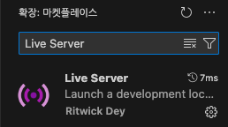
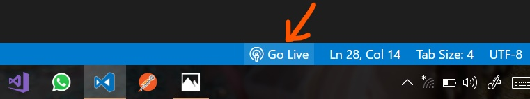

# EVM Blockchain Benchmarking UI


## 📋 Overview
This repo provides an easy-to-use web interface to benchmark EVM-compatible blockchains. The UI allows you to input a `Provider URL` and specify a `block range`, and it will automatically collect and display essential data like:
- Block per data
- Elapsed time and Transactions Per Second (TPS)
- Average of gas price
- Total transactions count and total used fee

Additionally, the results are visualized with interactive charts powered by [`echarts.js`](https://echarts.apache.org/en/index.html), offering a clear and intuitive way to analyze blockchain performance.

You can quickly access and use the tool directly via the following link:

👉 https://imelon2.github.io/evm-block-benchmark/

> [!IMPORTANT]
> Due to GitHub Pages policies, the blockchain RPC provider URL must use either HTTPS or localhost.</br>
> If your provider uses HTTP (not HTTPS), you cannot directly use the tool on GitHub Pages due to security policies. Follow next steps to run the tool locally

</br>

## 🌐 Running Locally for HTTP Providers
### 1. Clone the Repository
```shell
git clone https://github.com/imelon2/evm-block-benchmark.git
cd evm-block-benchmark
```
### 2. Live Server VS Code Extension
<div align="center">

</div>

(1) Install the *Live Server extension* from the VS Code Extensions Marketplace.

</br>



(2) Open a project and click to `[Go Live]` from the status bar to turn the server on/off.

</br>

## 🖼️ Example Charts

